# Systolic Recurrent Wave Network

This repository evaluates a Systolic Recurrent Wave Network (SRWN) as an anytime model: can iterative wave refinement improve predictions across waves, reduce compute with confidence-based halting, and stay competitive with conventional networks.

## Research questions

1. Does recurrence in SRWN provide measurable refinement?
2. Does adaptive halting reduce SRWN compute with acceptable accuracy loss?
3. On Fashion-MNIST, where is the SRWN vs CNN tradeoff frontier?
4. Can SRWN beat CNN on accuracy, or on both accuracy and compute?

## Experiments run

1. Parity ablation: recurrent SRWN vs ablated SRWN ([srwn_experiment.py](srwn_experiment.py)).
2. Parity benchmark: SRWN variants vs MLP with training and tradeoff plots ([srwn_benchmark.py](srwn_benchmark.py)).
3. Fashion-MNIST baseline: SRWN vs 2-layer CNN ([fashion_mnist_benchmark.py](fashion_mnist_benchmark.py)).
4. Fashion-MNIST v2: deeper and wider SRWN sweep ([fashion_mnist_v2.py](fashion_mnist_v2.py), [fashion-mnist-v2.py](fashion-mnist-v2.py)).
5. Fashion-MNIST v3: very wide SRWN push (h64→h192) ([fashion_mnist_v3.py](fashion_mnist_v3.py), [fashion-mnist-v3.py](fashion-mnist-v3.py)).
6. Fashion-MNIST v4: wide SRWN with dropout regularization ([fashion_mnist_v4.py](fashion_mnist_v4.py), [fashion-mnist-v4.py](fashion-mnist-v4.py)).

## Current headline findings

1. Recurrence is functionally real on parity: early columns improve across waves in recurrent SRWN and stay flat in ablated SRWN.
2. Adaptive halting reduces SRWN compute significantly on parity and moderately on Fashion-MNIST.
3. v2 showed width is a stronger lever than depth in tested ranges.
4. v3 showed that even extreme width did not match CNN accuracy and introduced non-monotonic width behavior.
5. v4 (dropout 0.1) did not beat CNN; best SRWN was 0.8608 vs CNN 0.8906.

## What each Fashion-MNIST phase shows

### v2 (deeper/wider)

- Showed directionally that width helps more than depth.
- Did not produce an SRWN variant that beats CNN on both accuracy and MACs.

### v3 (extreme width)

- Tested whether very wide SRWN can close the accuracy gap.
- Best SRWN remained below CNN accuracy.
- At larger widths, SRWN compute crossed CNN compute while still trailing in accuracy.

### v4 (dropout regularization)

Objective:
- Test whether dropout p=0.1 stabilizes medium-width SRWN and raises the v3 accuracy ceiling.

Result (25 epochs, rows=3, cols=4, waves=3):
- CNN baseline: 0.8906
- Best SRWN: 0.8608 (`wide_d01_r3_h96_w3`)
- Gap to CNN: 0.0298
- No SRWN variant beat CNN accuracy.
- Non-monotonic width behavior persisted even with dropout.

Generated artifacts:
- [outputs/fashion_v4_metrics.json](outputs/fashion_v4_metrics.json)
- [outputs/fashion_v4_verdict.json](outputs/fashion_v4_verdict.json)
- [outputs/fashion_v4_results.md](outputs/fashion_v4_results.md)
- [outputs/fashion_v4_accuracy_bar.png](outputs/fashion_v4_accuracy_bar.png)
- [outputs/fashion_v4_compute_bar.png](outputs/fashion_v4_compute_bar.png)
- [outputs/fashion_v4_acc_vs_macs.png](outputs/fashion_v4_acc_vs_macs.png)

## Inline plot gallery

Small inline previews are shown below for quick read-through. Click any image to open full size.

### Parity benchmark

<a href="outputs/train_loss.png">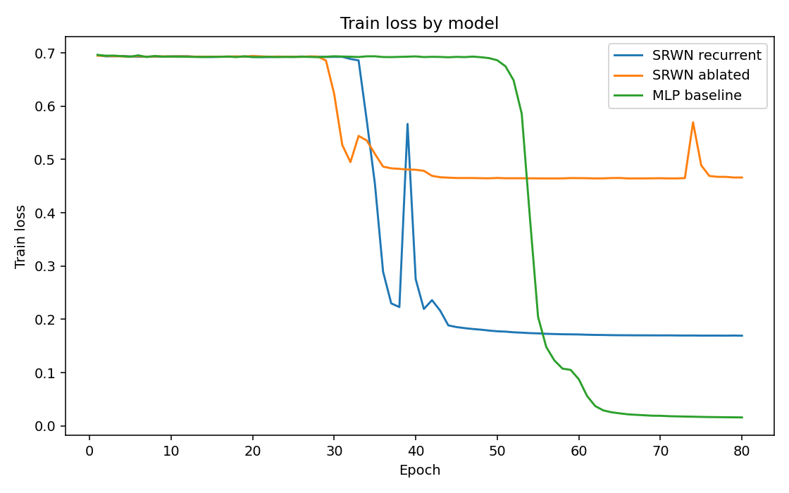</a>
<a href="outputs/val_accuracy.png">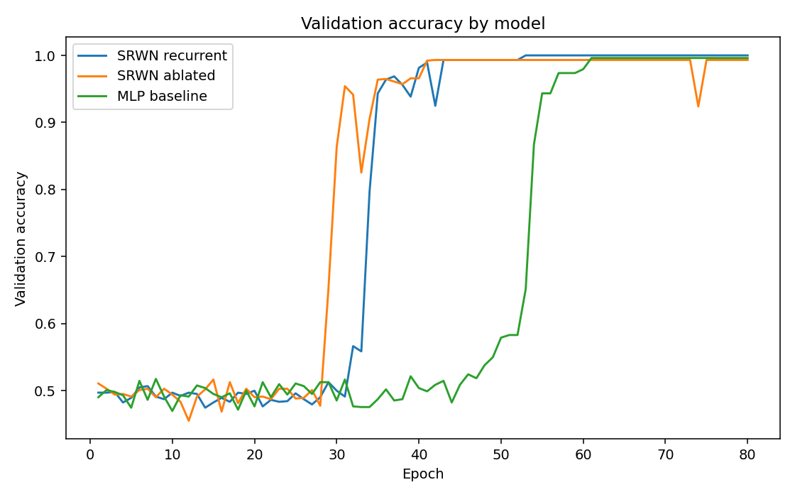</a>
<a href="outputs/accuracy_vs_compute.png">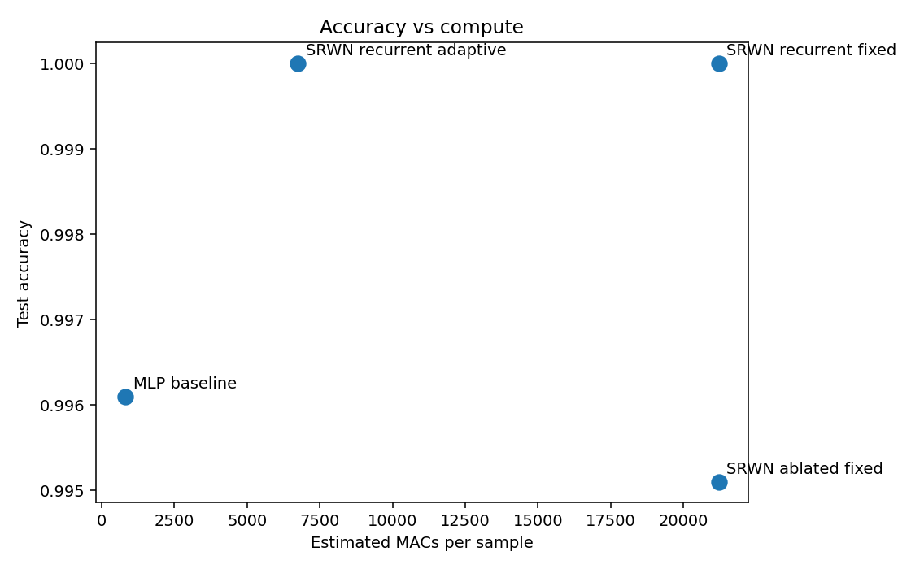</a>

### Fashion baseline

<a href="outputs/fashion_train_loss.png">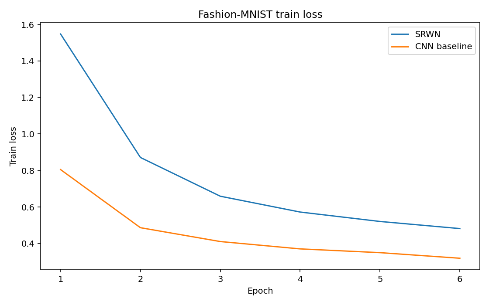</a>
<a href="outputs/fashion_val_accuracy.png">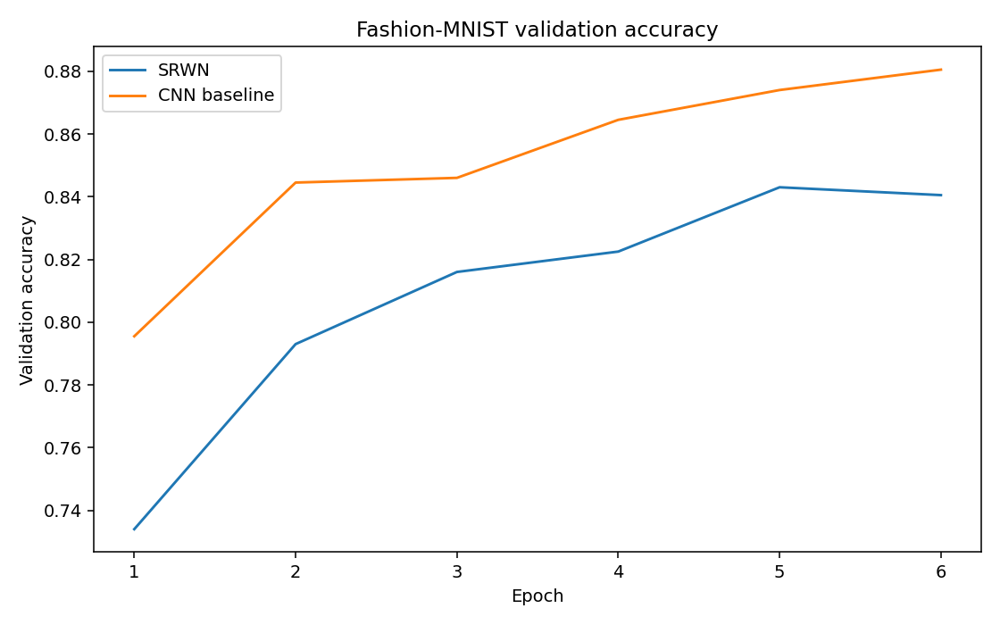</a>
<a href="outputs/fashion_accuracy_vs_compute.png">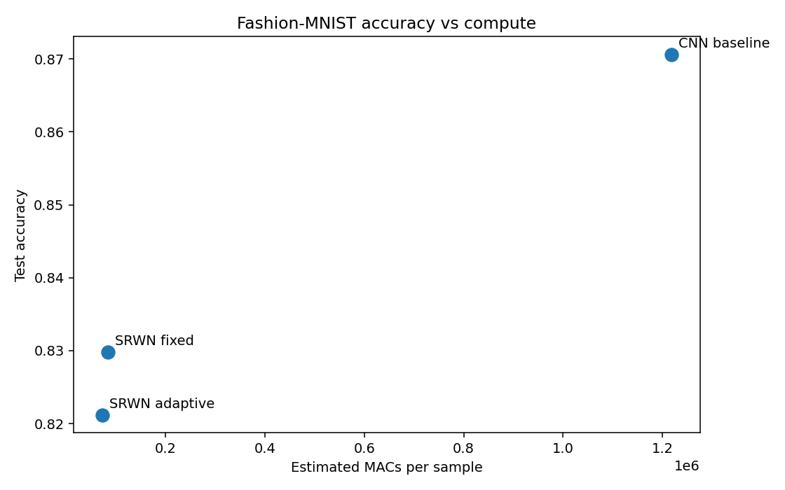</a>

### Fashion v2 (deeper and wider)

<a href="outputs/fashion_v2_accuracy_bar.png">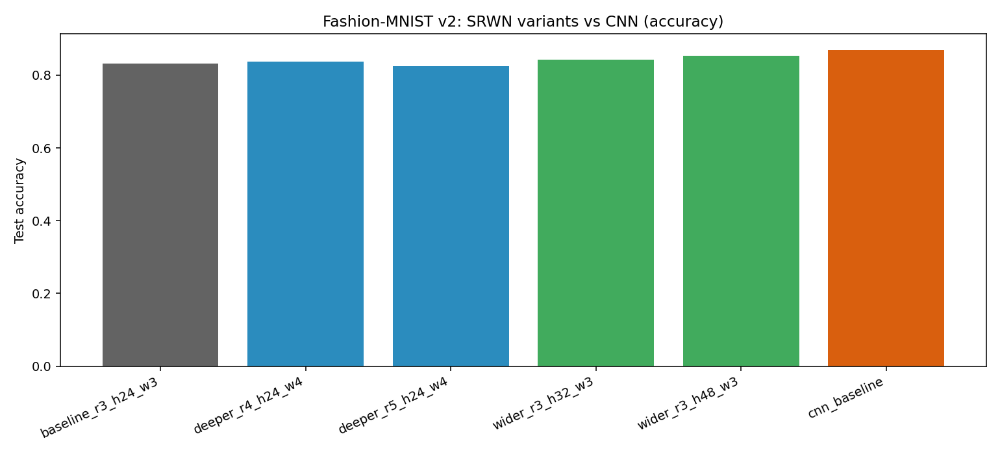</a>
<a href="outputs/fashion_v2_compute_bar.png">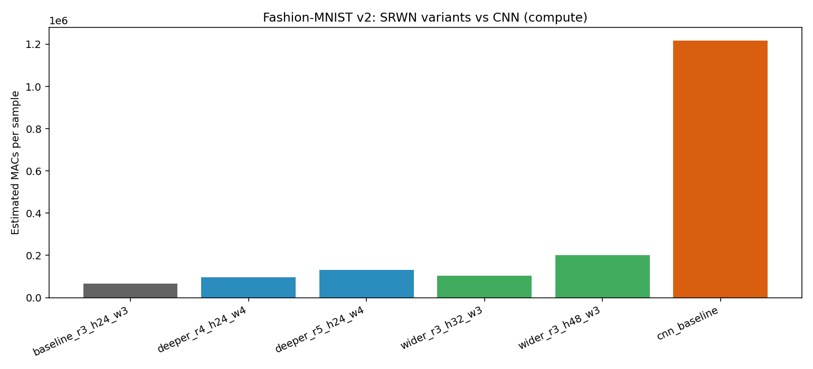</a>
<a href="outputs/fashion_v2_acc_vs_macs.png">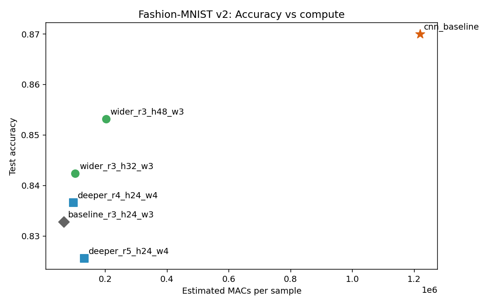</a>

### Fashion v3 (extreme width)

<a href="outputs/fashion_v3_accuracy_bar.png">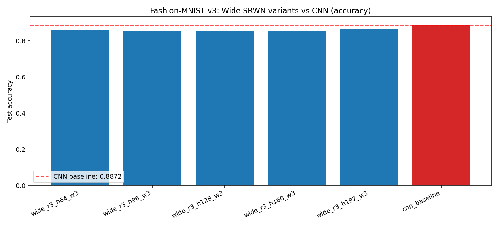</a>
<a href="outputs/fashion_v3_compute_bar.png">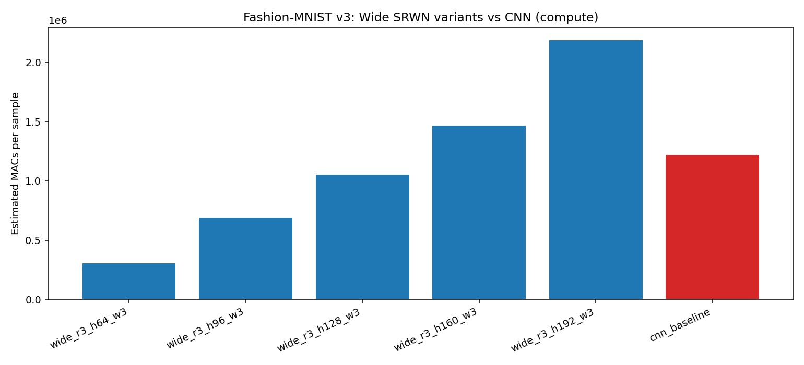</a>
<a href="outputs/fashion_v3_acc_vs_macs.png">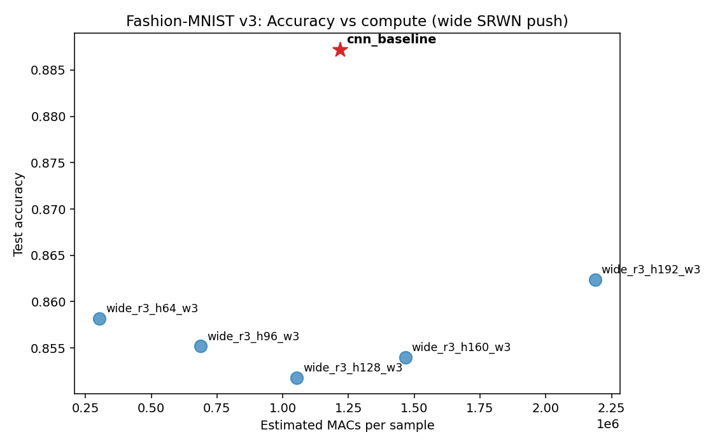</a>

### Fashion v4 (dropout 0.1)

<a href="outputs/fashion_v4_accuracy_bar.png">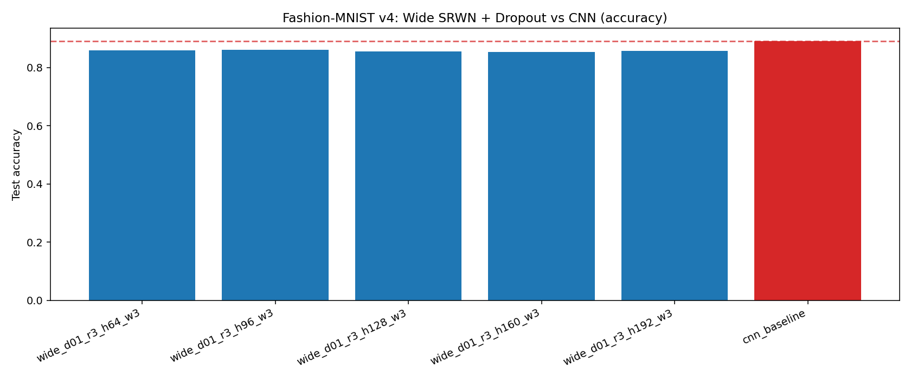</a>
<a href="outputs/fashion_v4_compute_bar.png">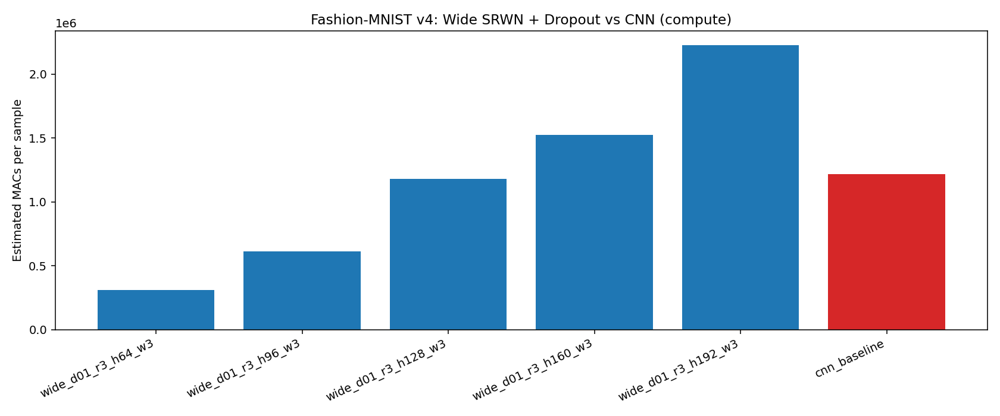</a>
<a href="outputs/fashion_v4_acc_vs_macs.png">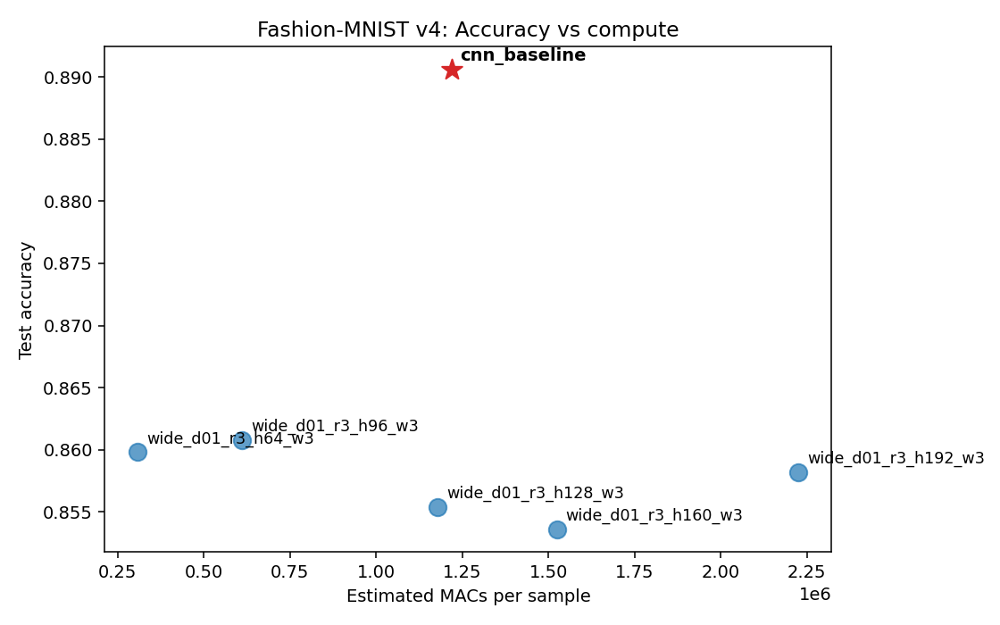</a>

## Run commands

1. Parity ablation:

```bash
D:/apps/Python39/python.exe srwn_experiment.py --json
```

2. Parity benchmark:

```bash
D:/apps/Python39/python.exe srwn_benchmark.py --epochs 80 --out-dir outputs
```

3. Fashion baseline:

```bash
D:/apps/Python39/python.exe fashion_mnist_benchmark.py --out-dir outputs
```

4. Fashion v2 sweep:

```bash
D:/apps/Python39/python.exe fashion-mnist-v2.py --out-dir outputs --epochs 8
```

5. Fashion v3 wide push:

```bash
D:/apps/Python39/python.exe fashion-mnist-v3.py --out-dir outputs --epochs 25
```

6. Fashion v4 dropout sweep:

```bash
D:/apps/Python39/python.exe fashion-mnist-v4.py --out-dir outputs --epochs 25 --dropout-rate 0.1
```

## Full results narrative

See [outputs/results.md](outputs/results.md) for the consolidated cross-experiment story and interpretation.
